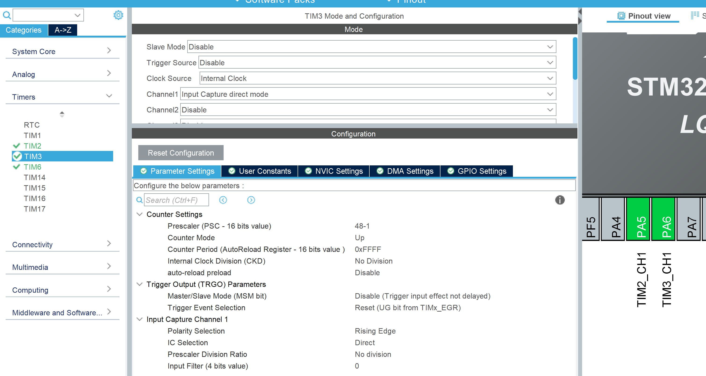
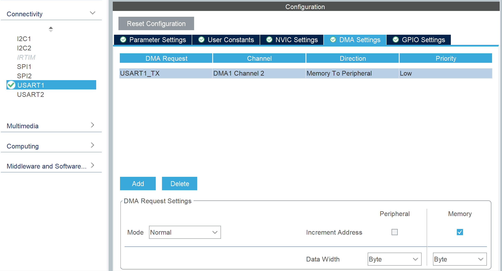

# DC Motor Control
## Clock configurations

## MCU and GPIOs

## NVICs

## Timers
Timers clock sources with frequencies can be seen in [Clock source](#clock-configurations).

### TIM6
This timer runs with freq. 1 Hz blinking LED and sending out messages via UART.

### TIM2
DC Motor is controlled using L298N module as seen in [schematic](#schematic). The L298N module requires PWM signal to adjust the speed of the DC motor. PWM signal is sent out using this Timer. PWM is configured with 10 kHz. PWM signal is sent out from Pin PA5. 10 kHz in time is: 100 us (microseconds). Basically, the timer goes HIGH -> LOW -> HIGH every 100 us (one full cycle).

### TIM3
10 kHz PWM signal, which is sent out from the IR module, is received here. This signal is received in Pin PA6. Here, the timer runs at freq. of 1 MHz. Time = 1 / 1 MHz = 1 us. This Input Capture Timer ticks every 1 us. To capture the incoming full PWM signal (rising edge to rising edge), this will tick 100 times.

## UART
UART is used for sending out messages.

## Schematic

## App working short infos
1. PWM duty percentage min (PWM_DUTY_PERC_MIN 70) and max (PWM_DUTY_PREC_MAX 90) value are chosen.
2. [TIM6](#tim6) is used as app timer running with frequency of 1 Hz. It basically gets the latest timer counted by the [TIM3](#tim3), and sends out via UART. Moreover, it keeps toggling a LED.
3. [TIM2](#tim2) is used to send out PWM signa to the L298N module, which then adjust voltage level to adjust the speed of the DC motor.
4. [TIM3](#tim3) is used as Input Capture to capture signals coming from IR module. IR module sends out HIGH logic signal on detecting gaps in the Encoder Disc attached to the DC motor. Basically, the time counts calculated by the TIM3 is the time count between two gaps in the Encoder Disc.
5. Setting direction of the DC motor rotation. There are two pins on the L298N module, which can be set HIGH from the MCU to set direction of the DC motor. For now, one of this pin is set HIGH conencting to the 5V of the MCU, and thus the motor rotated in only one direction and it will always be HIGH till the pin is conencted to 5V. It is enough for now, as aim is to control the speed of the Motor, not the direction. In case of Start/Stop and direction choose needed, both of these pins can be controlled using Output pins of the MCU.

Below is measured time count (suitable mid value taken) by the TIM3 between two gaps in the Encoder Disc attached to the DC Motor:
| PWM % | Time count | RPM                                 |
| ----- | ---------- | ----------------------------------- |
| 70    | 55000      | (60 × 10^6) / (20 × 55000) = 54.55  |
| 80    | 40000      | (60 × 10^6) / (20 × 40000) = 75.00  |
| 90    | 27000      | (60 × 10^6) / (20 × 27000) = 111.11 |

