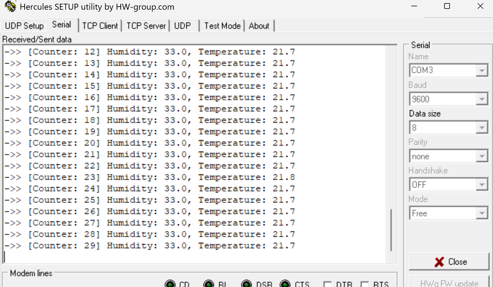

Below are the GPIOs for External Push-Button, LEDs, and UART.  

---

External crystal is used as clock source for the MCU.  
  

---

Below are the NVICs.  

---

Below is the configuration for TIM6.  
  

---

Below is the configuration for TIM14.  

---

Below is the configuration for UART. This is used to send the DHT11 sensor data to the PC through UART-USB module.  
  
  
  

---

Below, the sensor data can be seen.  

