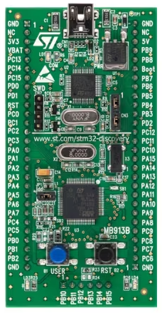

# STM32F0-Discovery-Board
### The repo contains Examples for STM32F0-Discovery-Board.

**Description:**
- Board code: STM32F0DISCOVERY
- MCU: STM32F051R8T6
- IDE used: STM32CubeIDE 1.16.0

### Projects:
| S.No. | Project                           | Short-Info            |
|-------|-----------------------------------| --------------------  |
| 1     | LED_Blink                         | ...                   |
| 2     | PushButton_EXTIInterrupt_LED      | ...                   |
| 3     | Timer_TIM6_LEDBlink               | ...                   |

### STM32F0-Discovery-Board

