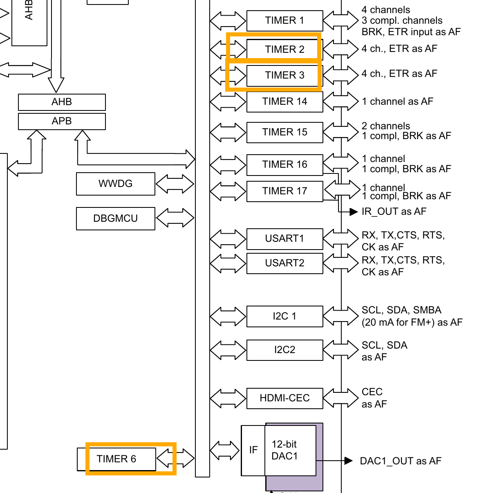
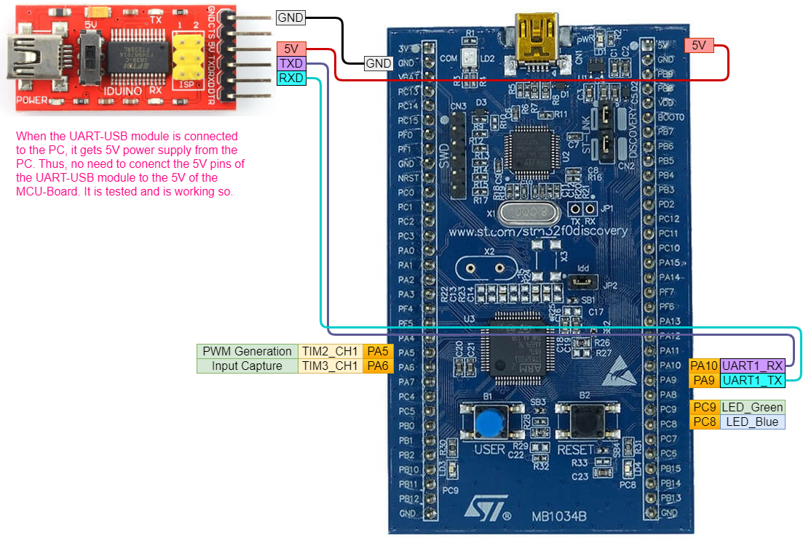

# Timer_InputCapture

**Timers:**  
- TIM6: Used at app timer running with freq. 1 Hz. (Blinking Blue LED, Sending put message through UART)
- TIM2: Used for sending out PWM signal
- TIM3: Used as ***Input Capture***
## MCU and GPIOs

## Clock source

## NVICs

## Timers
- Timers clock sources with frequencies can be seen in [Clock source](#clock-source)

### Timer for App
- This timer runs with freq. 1 Hz blinking LED and sending out messages via UART.

### Timer for PWM
To test the ***Input Capture***, PWM signal is sent out using this Timer. PWM is configured with 10 kHz. PWM signal is sent out from Pin PA5. 10 kHz in time is: 100 us (microseconds). Basically, the timer goes HIGH -> LOW -> HIGH every 100 us (one full cycle).

### Timer for Input Capture
10 kHz PWM signal, which is sent out from TIM2, is received here. This signal is received in Pin PA6. Here, the timer runs at freq. of 1 MHz. Time = 1 / 1 MHz = 1 us. This Input Capture Timer ticks every 1 us. To capture the incoming full PWM signal (rising edge to rising edge), this will tick 100 times.

## UART
UART is used for sending out messages, with for e.g. time difference between two rising edges.

## Schematics

## Evidence

